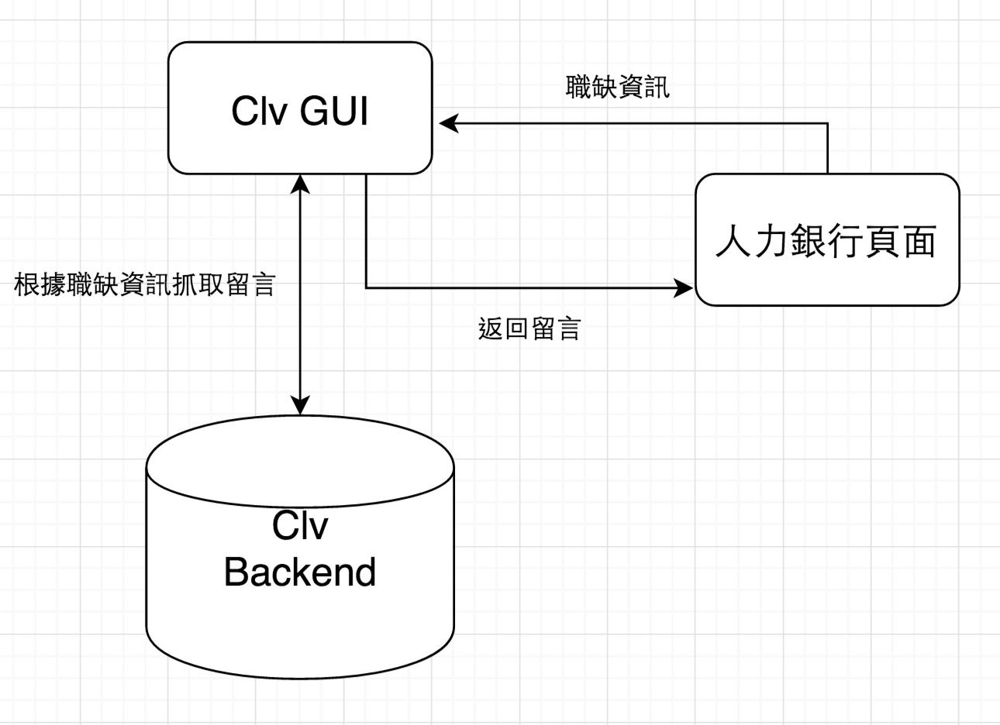

# Clairvoyance

[](https://chrome.google.com/webstore/detail/clairvoyance-%E6%B1%82%E8%81%B7%E5%A4%A9%E7%9C%BC%E9%80%9A/mdneakdlnoidknagkamfeambdefhppbi?hl=zh-TW&gl=TW)

- You might ask what "Clairvoyance" means.

- Let me show you the answer:


- An open source project

- Make the world a better place (XD

- Exposing Information

# Get started 

## Extension

- First you need to add a `config.json` in root directory

```json
{
    "backend": "BACKEND_URL",
    "dev": {
        "auth": {
            "authUri": "AUTH_URL",
            "redirectUri": "CALLBACK_URL",
            "clientId": "FB_APP_ID"
        }
    }
}
```

- Then run `npm install`

- `npm run dev:chrome`

- Then you can load the directory: `chromeExtension` as a chrome extension

# GUI

- If you just want to develop the user interface:

```
> npm install
```

```
> npm start
```

- Then you can check the basic ui at http://localhost:80808

- You can modify `front-end/dev.js` to change the view

> I know it looks bad, and not so trivial, 

> plz give me some time to make it better XD


# Architecture

- Simpify version



## Front-end

- react, redux, redux-saga

## Back-end

- lambda

- dynamodb

- restore s3

